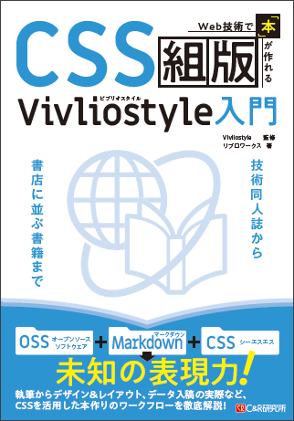
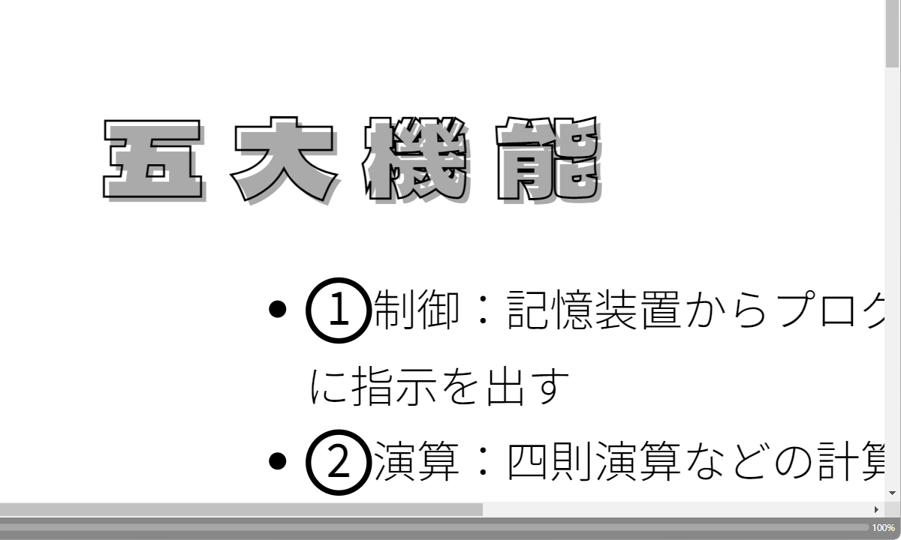
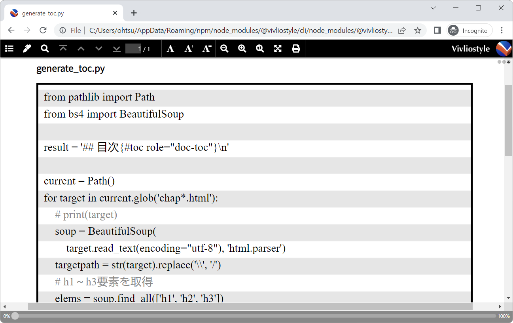

# CSSkumihan_samples
このリポジトリには **『Web技術で「本」が作れるCSS組版 Vivliostyle入門』** （2023年5月12日、C&R研究所刊）のサンプルファイルを収録しています。

[【書籍ページ】https://www.c-r.com/book/detail/1493](https://www.c-r.com/book/detail/1493)




https://libroworks.co.jp

## 吹き出し版「走れメロス」
以下のサンプルは書籍未収録です。応用例としてご覧ください。

- [Vivliostyle Viewerで表示](https://vivliostyle.org/viewer/#src=https://libroworks.github.io/CSSkumihan_samples/samples/melos/sample5_x_Melos.html)
- [素のHTML（Vivliostyleを通さない状態）](https://libroworks.github.io/CSSkumihan_samples/samples/melos/sample5_x_Melos.html)
- [ソース](https://github.com/libroworks/CSSkumihan_samples/blob/main/samples/melos/sample5_x_Melos.html)

## 刊行後に発見された注意点＆対処法
### Noto Sans JPと袋文字（書籍146ページ）
2023年4月頭にGoogle FontsのNoto Sans JPのデータに変更が加えられました。大部分のサンプルには影響ありませんが，text-strokeプロパティによる袋文字（sample5-decoration.md）は，次のように表示がおかしくなります。


フォントデータの問題なので，現状の対処方法としては，問題を起こさないフォントに置き換えます。



参考：samples/text_stroke_test/css/sample5-decoration.css

根本的な解決策としては，Noto Sans JPのフォントデータが変わるか，Chromiumのtext-strokeの実装が修正されるのを待つしかなさそうです。


### ソースコードの縞模様（書籍163ページ，235ページ）
235ページに解説がありますが，repating-linear-gradientによるグラデーションを使用した場合，InDesignからのPDF書き出しに失敗します。本書の中でrepating-linear-gradientを使用しているのは，163ページのソースコード背景です。

InDesignを使わない入稿でも，**「RGBから変換できない」といった入稿トラブル**が起きるようなら，次の対処法をお試しください。

まず，グラデーションの代わりになる画像を用意します。ズレをなるべく避けるために，pre要素の行送りに合わせて高さを設定します。本書サンプルでは行送り18Qなので約17px，つまり34pxの高さの画像を用意します。幅は適当でかまいません。


repeating-linear-graientの部分を，次のように置き換えます。ポイントは，背景画像のサイズを縞模様1セット分の大きさに合わせて指定することです。行送りが18Qなので，縞模様1セットの高さは36Q，つまり9ミリとなります。幅はpre要素に合わせます。

```
  /* background: repeating-linear-gradient(#eee 0, #eee 18Q, #fff 18Q, #fff 36Q); */
  background-image: url(vs_pre_bg.png);   //←背景画像を参照
  background-size: 118mm 9mm;             //←画像サイズを指定
  background-repeat: repeat-y;            //←y方向にリピート
```



参考：samples/pre_gradient_test/css/sample5-code.css
