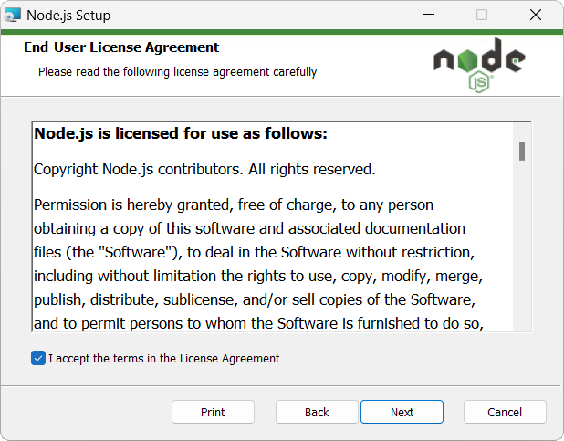
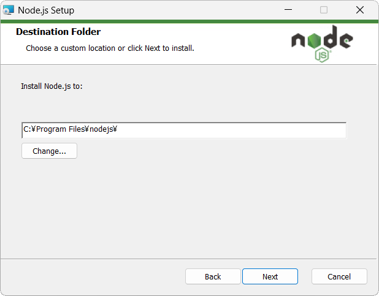
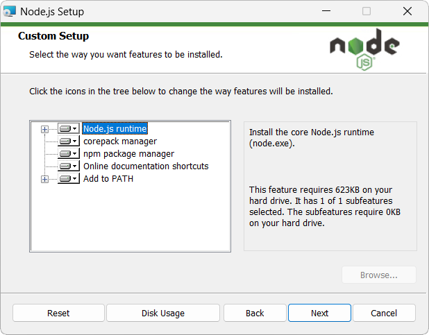
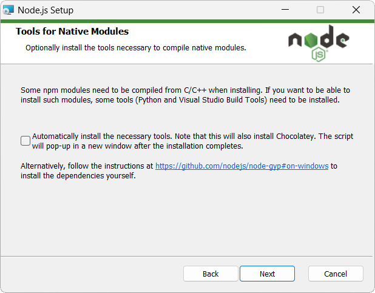
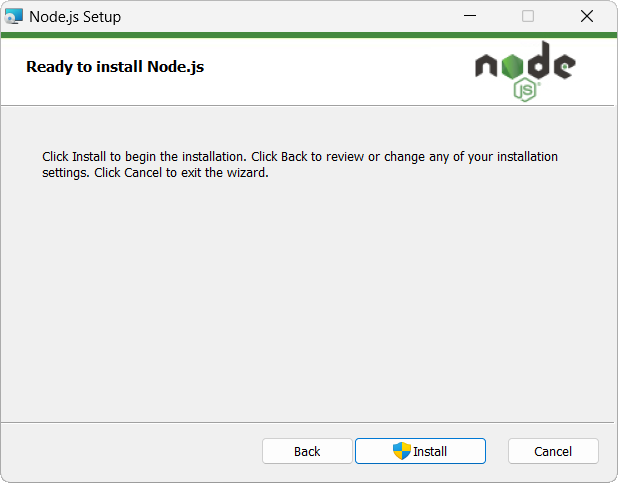

---
link:
  - rel: 'stylesheet'
    href: 'css/sample1b.css'
---

# コンピュータの 重箱の隅

『Vivliostyle CSS組版入門』サンプル

## 【画像が多い紙面】node.jsの インストール
公式ページからダウンロードしたファイルをダブルクリックすると、インストーラが起動する。あとは画面の指示に従って操作を進めていく。最初に表示される使用許諾を確認し、［I accept the terms...］にチェックを入れて、［Next］をクリックする。

{width=220px}

インストール先のファイルパスを変更できるが、基本は初期設定のままでよい。［Next］をクリックする。

{width=220px}

必要なインストールオプションを確認しておこう。通常は初期設定のままで問題ないはずだ。

{width=220px}

C++でネイティブモジュールを開発する予定があるなら、チェックボックスをオンにする。

{width=220px}

これでインストールの準備は完了した。［Install］をクリックしてしばらく待とう。

{width=220px}

