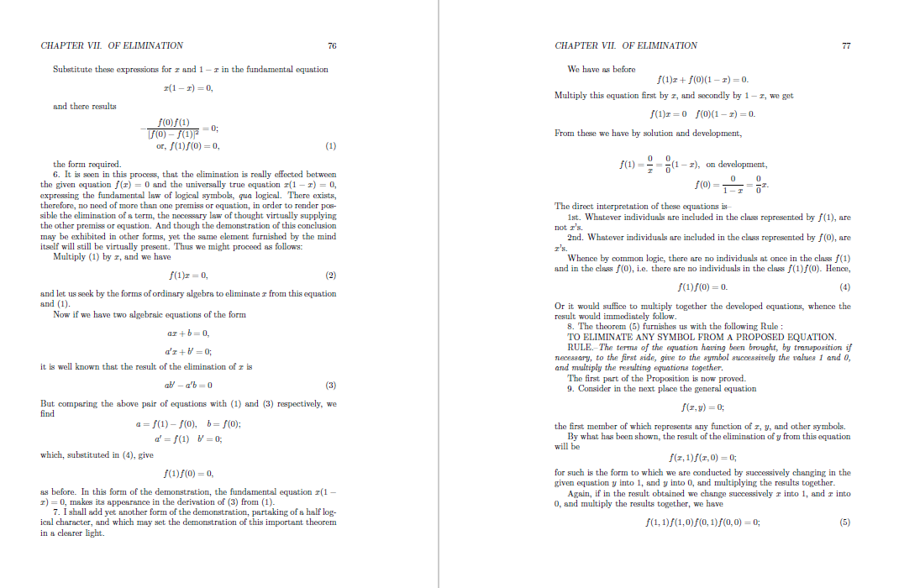
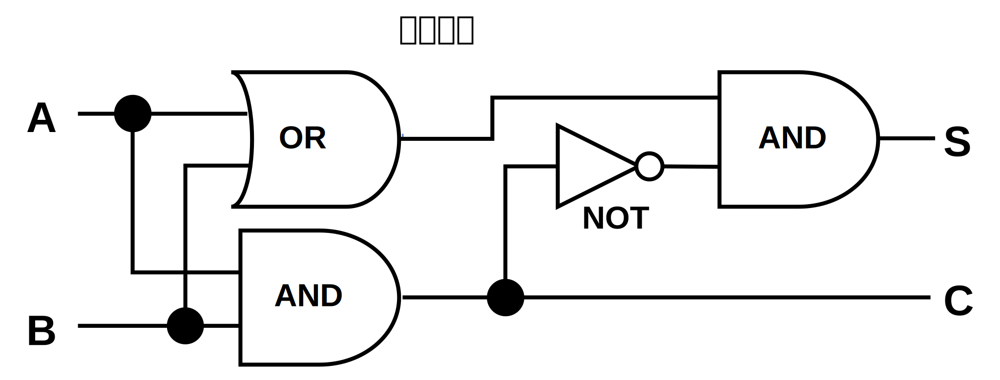

---
link :
  - rel: "stylesheet"
    href: "css/sample5-figurefloat.css"
---

# コンピュータの 重箱の隅

『Vivliostyle CSS組版入門』サンプル

## 論理回路から加算器は飛躍しすぎ？
過去に「コンピュータの歴史」を**ブール論理（Boolean Logic）**の誕生あたりからたどろうとして、いろいろと調べてみたのだが、**ジョージ・ブール氏**の考えたものは現在ブール論理として習うものとかなり違っていた。ブール氏が考えたのは、*言葉で推論するとどうしてもあいまいさが生じるので、数式を使って推論すべきだ*というものだった。実際、ブール氏の論文を見てみると、足し算や掛け算らしき数式しか書かれていない。

{.float-bottom}

現在使われている論理記号やAND、ORなどの用語は、後世に**数理論理学**として発展していく中で作られたもので、最初のとっかかりのアイデアを考えた人として、ブール氏の名前を冠することにしたらしい。

### 論理回路の誕生
ブール氏が論文を書いてから100年ほどして、電信に使われるリレーを使った**論理回路（Logic Circuit）**が誕生した。**クロード・シャノン氏**が論理回路についての論文を書いたのが1937年で、ほぼ同時期に最初のデジタルコンピュータも誕生している。このあたり順番がはっきりしなくてモヤッとするが、たいていの発明・発見は、複数の人が同時期に同じ答えにたどりつくもののようだ。

{width=210px .float-right}

ここで不思議なのは、スイッチを直列に並べてAND回路、並列に並べてOR回路が作れるというのは、ブール論理の延長として理解できる。しかし、その先、つまり**論理回路を使って計算する**という発想はどこからでてきたのだろう？

2進数1桁の計算を行う**半加算器（Half Adder）**は、AND回路2つとOR回路1つ、NOT回路1つの組み合わせで作れる。

{width=210px .float-right}

しかし、これがブール論理の延長で、普通に出てくるとはちょっと考えにくい気がする。ブール論理は「AND（かつ）」「OR（または）」などで真偽を求めるものであって、四則演算するものではないはずだ。

残念ながら、加算器の発明者の資料は見つけられなかった。おそらく、何かを作ろうとして論理回路の組み合わせを考えているうちに、「0+0=00」「0+1=01」「1+0=01」「1+1=10」という結果を出せば足し算する回路が作れるという答えにパッとたどりついたのだろう。

世の中には頭のいい人はたくさんいるので、このぐらいは複数の人が同時に思いつくものなのかもしれない。

## 通信機能は5大装置のどこに入る？
コンピュータサイエンスの初歩として必ず登場するのが、**ノイマン型コンピュータ（von Neumann architecture）**もしくは**コンピュータの5大装置**だ。コンピュータは「制御」「演算」「記憶」「入力」「出力」という5つの装置で構成されるという説で、**フォン・ノイマン氏**がその論文を書いたので、ノイマン型と呼ぶ。ノイマン氏は悪魔のように頭がいい人だったが、5大装置をノイマン氏自身がゼロから考えたわけではなく、**EDVAC**という開発中のコンピュータを見学して、「つまり、こういうことだろ？」と論文をまとめたそうだ。

- 制御：記憶装置からプログラムを読み込み、各装置に指示を出す
- 演算：四則演算などの計算を行う
- 記憶：プログラムやデータを記憶する
- 入力：外部から情報を取り込む
- 出力：外部に情報を書き出す

{.float-bottom}

今のパソコンやスマートフォンでも、5大装置という構成は変わらないので、今の教科書にもそのまま出てくる。ただ、5大装置の図に、実際のCPUやメモリ、キーボードなどの部品を当てはめていくと、ふと困ったことに気付く。通信モデムやNIC、タッチディスプレイなど、*5つのカテゴリにうまく当てはまらない機器*が結構出てくるのだ。

そのときはしかたなく、入力と出力を図の右側に配置して、「入出力兼用の機器もある」と説明したのだが、もっとうまいやり方があったのではと今でもときどき思う。

ノイマン氏に聞いてみたいところだが、悪魔のように頭のいい人だったらしいので、「馬鹿め、そのぐらい自分で考えろ」といわれそうだ。

## デジタルは人間の頭の中にしかない
よくコンピュータは**デジタル**だという。デジタルは「連続した量」を意味する**アナログ**の対義語で、連続していないという意味から日本語では「離散的な値」ともいう。電気や光、音といった自然現象はすべてアナログだ。

ここでよく考えてみると、コンピュータの電子回路も電気が流れているからアナログではないかという答えにたどり着く。実際のところ、コンピュータの電気信号も連続的に変化していて微妙なブレがあり、*この範囲にだいたいおさまったら「1」、この範囲だったら「0」*という感じに決めて、デジタルと見なしているそうだ。

{.float-bottom}

自然界にはアナログしか存在せず、コンピュータもアナログ。ということは、純粋なデジタルは、人間の頭の中にしか存在しないということになる。加えていうとプログラム（ソフトウェア）も、人間のデジタル的な考え方を反映したものなので、デジタルといえる。

デジタルとアナログについて考えていくと面白いことがいろいろあって、昔のビデオテープや音楽テープはすべてアナログで、デジタル化したDVDやCDが登場したのは結構あとのことだ。これはなぜかというと、デジタルのほうがデータ量が増えるからだ。

例えばアナログで「100」を表す場合、単位や媒体は何かはわからないが、100の強さの信号があればいい。デジタルで100を表す場合、2進数だと「01100100」となるので7ビット必要になる。仮に1秒間に1つしか信号を送れないとすると、アナログでは1秒で済むところが、デジタルでは7秒必要という計算になる。つまり、デジタルのほうがデータ量が増えるわけで、これを解決するには電子回路をはるかに高速にするしかない。その発展に時間がかかったわけだ。

{width=300 .float-bottom}

データ量が増える以外のデジタルの弱点として、連続して変化するアナログを、段階的なデジタルに変換する過程で、変化途中の細かな情報が切り捨てられるという点がある。
アナログの信号（レコードとかフィルムとか）だったら、昔は読み取れなかった情報が未来の技術で読み取れる可能性があるが、デジタルの信号（DVDとかBDとか）はいつまで経っても記録時点のままなので、切り捨てられた情報は未来永劫復元できない。最近よく聞くデジタルリマスターも、大元のフィルムから起こすのであって、DVDを原本とすることはない。

などとと書きつつも、最近のAI技術では「存在しないものをそれらしく復元する」こともできてしまうので、将来的には何とかなってしまうかもしれないなとも思う。未来を見通すのは難しい。
